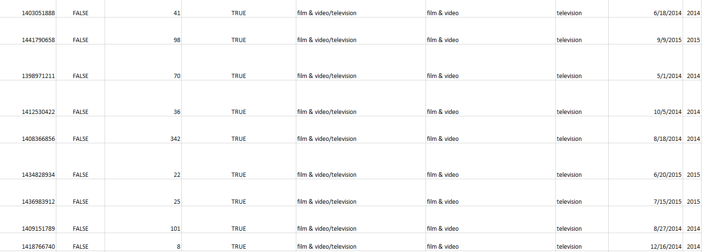
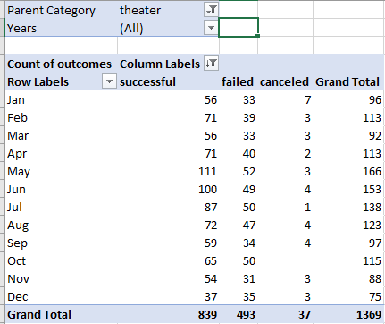
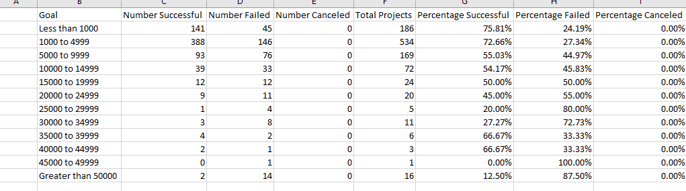
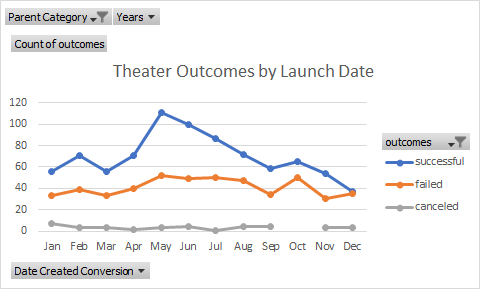
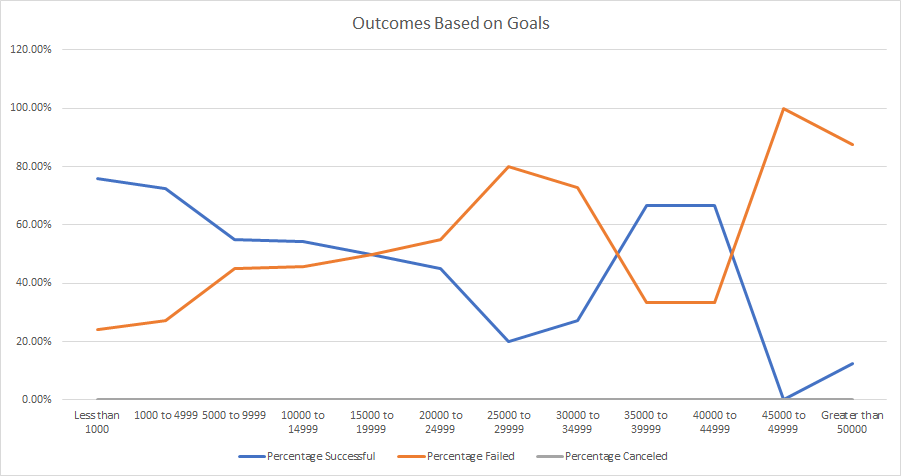

# Kickstarting with Excel

## Overview of Project
Louis is thinking about starting a crowdfunding campaign to help fund her play, 'Fever', so she asks for help

### Purpose
Help Louis to analyze the factors that would make crowdfunding campaigns successful as reference

## Analysis and Challenges

### Overview of the analysis
There are about 3800 records in the crowdfunding data.
First, the 'Category and Subcategory' column is separated into two columns, 'Parent category' and ' Subcategory'.
The 'launch_at' column is converted to readable format, then a 'years' column is created
After done the work above, the data looks like below:

### Analysis of Outcomes Based on Launch Date

In order to analyze 'theater' crowdfunding outcomes by Launch date, A pivot table is created with filters to filter the data by 'years' and 'Parent Category', then group the column by months. The table looks like below:

### Analysis of Outcomes Based on Goals

In order to analyze outcomes based on goals, 12 goal ranges were set and in each ranges, use 'countifs' function in Excel to get the numbers of successful campaigns, failed campaigns and canceled campaigns in Subcategory 'plays'. Then, Their percentages were calculated.

### Challenges and Difficulties Encountered
Separating 'Category and Subcategory' can be difficult. I didn't know how to do it at the beginning, then I followed instructions on module '1.3.1' to finish it.

## Results

- What are two conclusions you can draw about the Outcomes based on Launch Date?

1. The amount of crowdfunding campaigns on May and June are the largest
2. The amount of successful campaigns is always larger than the amount of failed and canceled campaigns

- What can you conclude about the Outcomes based on Goals?

The larger the goal money is, the more possibility of failure is

- What are some limitations of this dataset?

For money range larger than 15000, the data amount is too small. Results might be inaccurate

- What are some other possible tables and/or graphs that we could create?

The outcomes by 'year' can be created to see if the success rate increases in time
